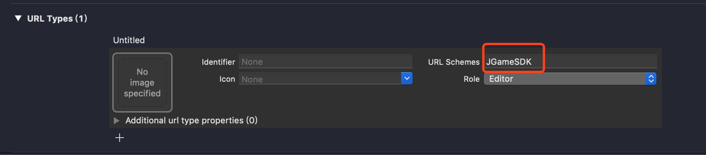
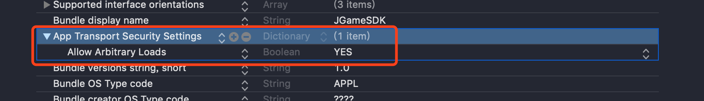

# JGameSDK使用帮助

## 1. 安装

使用cocoapods安装

`pod 'JGameSDK', '~>2.0'`


## 2. 配置支付宝回调scheme




## 3. 配置允许http调用




## 4. 代码调用

### 4.1. 注册回调

```objective-c
// 注册回调
[JGameSDK shared].delegate = self;
```

### 4.2. 在AppDelegate中传入openURL

```objective-c
// 9.0 以前调用
/*
- (BOOL)application:(UIApplication *)application
openURL:(NSURL *)url
sourceApplication:(NSString *)sourceApplication
annotation:(id)annotation {

    [[JGameSDK shared] openURL:url];
    return YES;
}
*/


// 9.0 以后调用
- (BOOL)application:(UIApplication *)app openURL:(NSURL *)url options:(NSDictionary<NSString*, id> *)options
{
    [[JGameSDK shared] openURL:url];
    return YES;
}
```

### 4.3. 用户登录

```objective-c
[[JGameSDK shared] popLogin];
```
### 4.4. 发起支付

```objective-c
- (IBAction)payPress:(id)sender {
    // 创建1分钱订单信息. appid请填写游戏实际的id
    // 其他信息请填写正确且完整.
    OrderRequestEntity *entity = [[OrderRequestEntity alloc] init];
    entity.appid = @"sczg";
    entity.server_id = @"test";
    entity.server_name = @"test";
    entity.role_id = @"test";
    entity.role_name = @"test";
    entity.money = @"1";
    entity.product_name = @"test";
    entity.product_desc = @"test";
    entity.game_order = @"test";
    entity.extension = @"test";
    entity.sign = @"test";

    // 发起支付
    [[JGameSDK shared] popPayWithOrderRequestEntity:entity];
}
```
