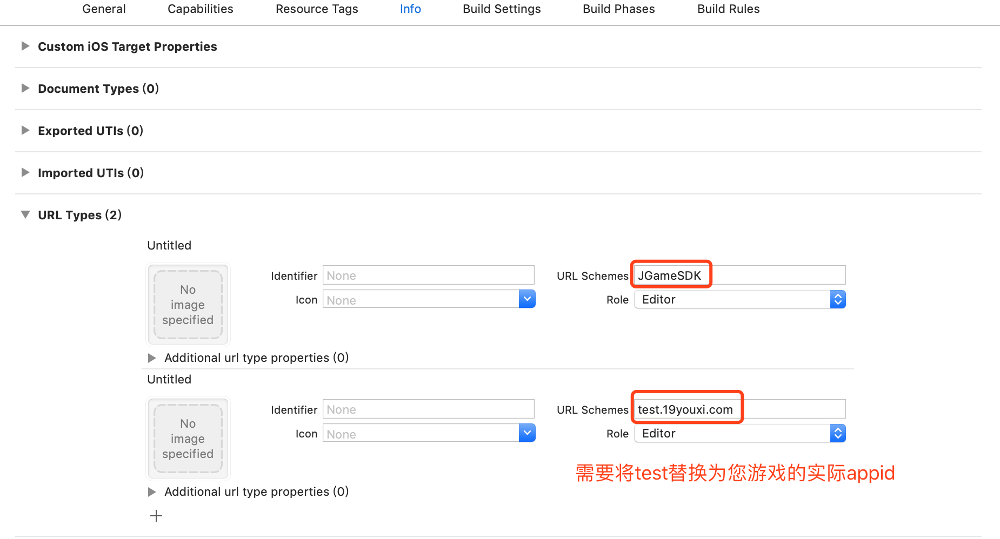
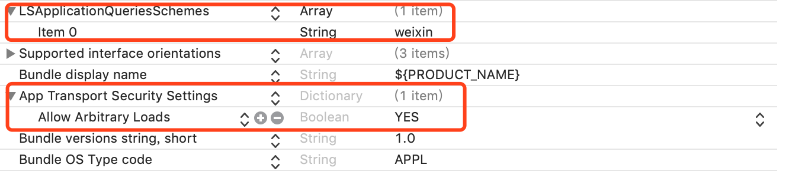

# JGameSDK使用帮助

## 1. 安装

使用cocoapods安装

`pod 'JGameSDK', '1.1'`

## 2. 配置支付宝、微信的回调scheme



第一项: `JGameSDK`

第二项: `test.19youxi.com`, 需将test替换为您实际的内部游戏appid. 非AppStore的appid.

## 3. 配置允许http调用和查询能否打开微信APP的功能




### 3.1. 添加`LSApplicationQueriesSchemes` , 并设置成Array. 添加项`weixin`

### 3.2. 允许HTTP调用


## 4. 代码调用

### 4.1. 开启SDK, 并注册回调

```objective-c
// 开启应用
// 此处的scheme必须与第二步配置的scheme一致.
[[JGameSDK shared] openWithWechatScheme:@"test.19youxi.com"];
// 注册回调
[JGameSDK shared].delegate = self;
```

### 4.2. 在AppDelegate中传入openURL

```objective-c
// 9.0 以前调用
/*
- (BOOL)application:(UIApplication *)application
openURL:(NSURL *)url
sourceApplication:(NSString *)sourceApplication
annotation:(id)annotation {

    [[JGameSDK shared] openURL:url];
    return YES;
}
*/


// 9.0 以后调用
- (BOOL)application:(UIApplication *)app openURL:(NSURL *)url options:(NSDictionary<NSString*, id> *)options
{
    [[JGameSDK shared] openURL:url];
    return YES;
}
```

### 4.3. 用户登录

```objective-c
[[JGameSDK shared] popLogin];
```
### 4.4. 发起支付

```objective-c
- (IBAction)payPress:(id)sender {
    // 创建1分钱订单信息. appid请填写游戏实际的id
    // 其他信息请填写正确且完整.
    OrderRequestEntity *entity = [[OrderRequestEntity alloc] init];
    entity.appid = @"1001";
    entity.server_id = @"test";
    entity.server_name = @"test";
    entity.role_id = @"test";
    entity.role_name = @"test";
    entity.money = @"1";
    entity.product_name = @"test";
    entity.product_desc = @"test";
    entity.game_order = @"test";
    entity.extension = @"test";
    entity.sign = @"test";

    // 发起支付
    [[JGameSDK shared] popPayWithOrderRequestEntity:entity];
}
```
